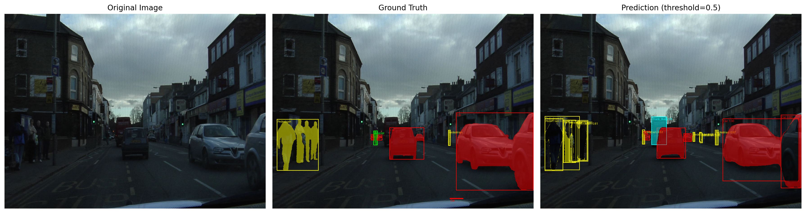
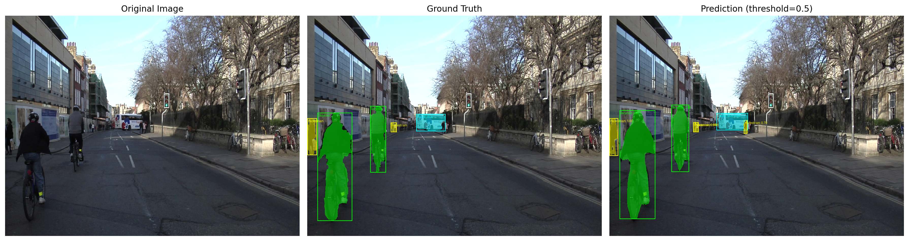
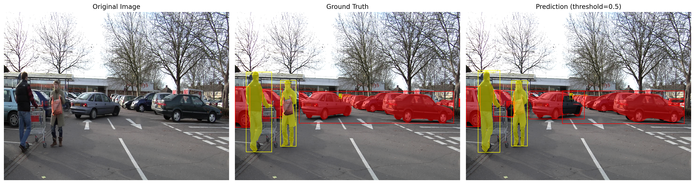
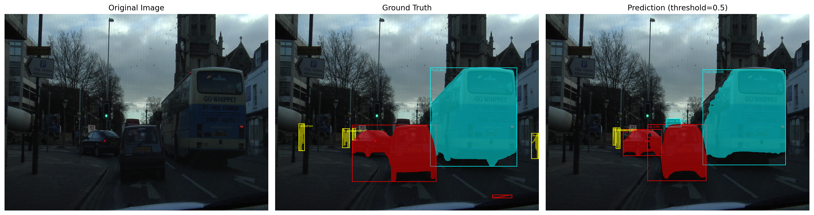

Authors: Ramneek Ahluwalia 

Description: This repository contains the code to implement a custom Mask R-CNN lti-task object detection and semantic segmentation model on the CamVid dataset

## Running Solution

This repository has the following structure 
```

├── CAMVID-MULTI-TAS
│   ├── data/
│   ├── src/
│   │   ├── analysis_results/
│   │   │   ├── instance_statistics.csv
│   │   │   ├── pixel_distribution.csv
│   │   │   └── results/
│   │   │       ├── evaluation_results/
│   │   │       ├── visualization_results/
│   │   │       └── histogram_based_augmentation.png
│   │   ├── pytorch_helper/
│   │   │   ├── __pycache__/
│   │   │   ├── coco_eval.py
│   │   │   ├── coco_utils.py
│   │   │   ├── engine.py
│   │   │   ├── transforms.py
│   │   │   └── utils.py
│   │   ├── camvid_maskrcnn_model.py
│   │   ├── camvidanalysis.py
│   │   ├── dataloader.py
│   │   ├── dataset_manager.py
│   │   ├── model.py
│   │   ├── setup.py
│   │   ├── test.py
│   │   └── train.py
│   ├── README.md
│   └── requirements.txt
```

Please ensure that your CamVId dataset is placed in the data folder and only run the setup.py file if you do not have the helper files already in the folder. 

## Visual Results

Some examples of the achieved predictions are shown below:


### Sample Model Predictions
<p align="center">
  
</p>

<p align="center">
  
</p>

<p align="center">
  
</p>

<p align="center">
  


## Acknowledgements
- Code snippets used from - COMP0248 - Week 4 accessible at: https://moodle.ucl.ac.uk/course/section.php?id=1056534
- CamVid dataset by University of Cambridge
- PyTorch Utility files 